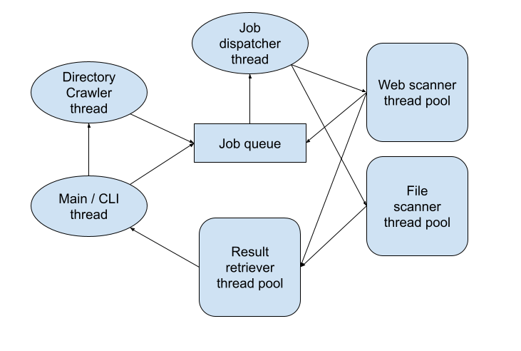

# Word counter

First homework from *Concurrent and distributed systems* course at Faculty of Computing in Belgrade. Concurrent counting of keywords from corpuses that are fed to program. Corpuses can be websites or file system directories/files.

## Description of system

- Main/CLI thread
  - Used for setting directories and websites for crawling and retrieving results of proccessed ones
- Directory crawler thread
  - Given some root directory, recursively crawl every subdirectory, and add all files in them in job quene for scanning
- Job Queue
  - Asynchronous connections between crawler and scanning thread pools
- Job Dispatcher thread
  - Takes jobs from job queue and delegates them to appropriate scanners
- Web scanner thread pool
  - Searches for keywords in given job (file corpuses)
- File Scanner thread pool
  - Search for keywords in given job (web corpuses - HTML page)
- Result retriever thread pool
  - Gets results for given corpuses, or *proccessing* if result is not yet ready

## Commands supported

| Command name | Argument | Desciprtion |
| :---: | :----: | :---: |
| ad | directory_name: String | adds directory for crawling |
| aw | website_address: String | adds website for scanning |
| get | corpus_name: String | blocking call for getting results |
| query | corpus_name: String | non-blocking call for getting results |
| cws | - | clears cached web results |
| cfs | - | clears cached file results |
| stop | - | gracefully exit application and shutdown all components |

## **Visual representation of above mentioned design**

